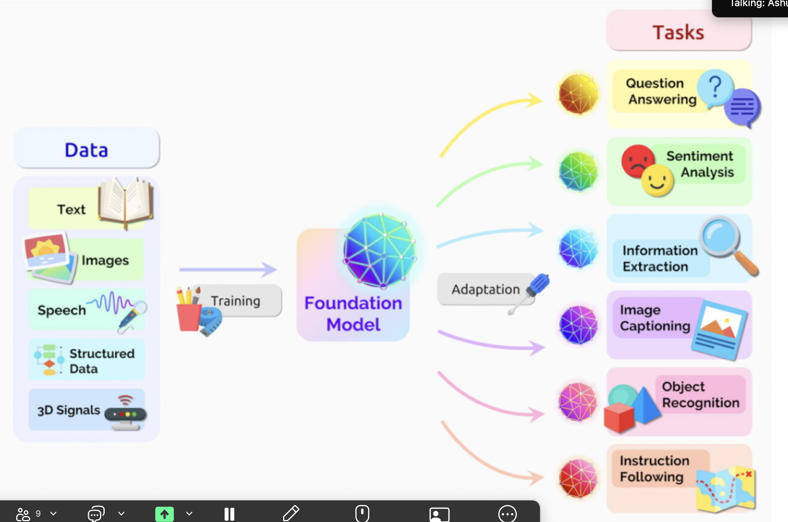
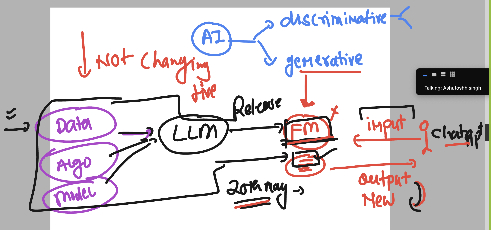
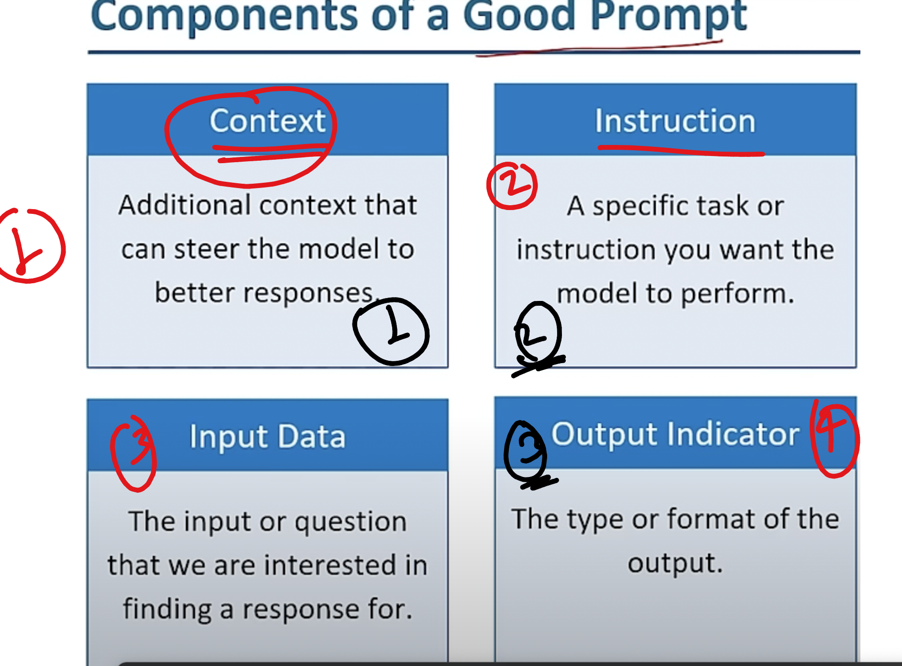

### overall understanding of AI in terms of use cases 
- there is 2 basic category 

## AI & GENAI 

## info about Foundational Model 

## final FM info 

## chagpt vs platform openai 

## Prompt crafting structure 

### some advanced prompting tech

