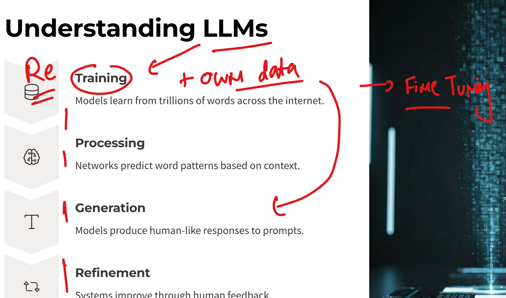
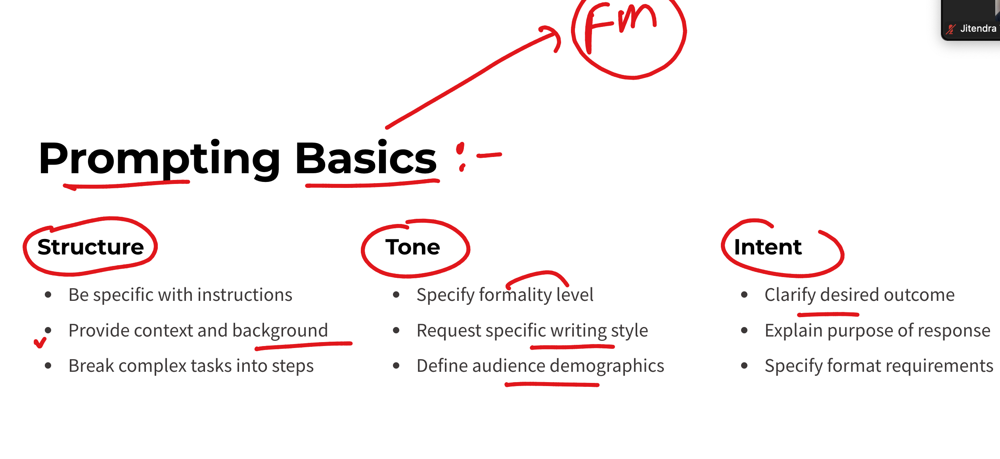
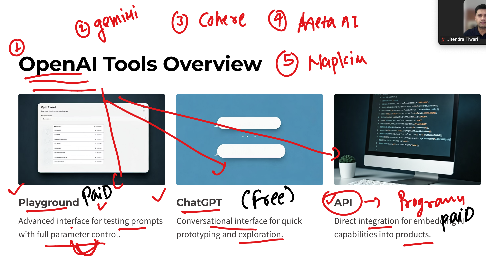
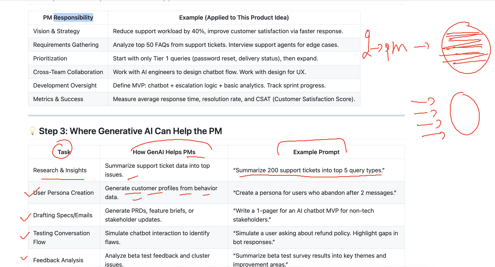

# oracle-genAI-20thmay2025

## revision 

### info about GenAI 


## more detail about LLM 



### Prompting revision 



## info about GENAI tools and openai offering tools



## using AI as PM in customer / user conversation / ticket data 




## Prompt to generate sample 10 lines of csv data 

```
act as customer review system manager which having idea about support ticketing system ,
generate 10 lines of csv data  as per given example
TicketID,cateogry,Ticktext message 
1, Password reset ,  i can't login to my account . please help me to reset my password.
2, Techinical Issue , the app keeps crashing when ever i try to open it .
```