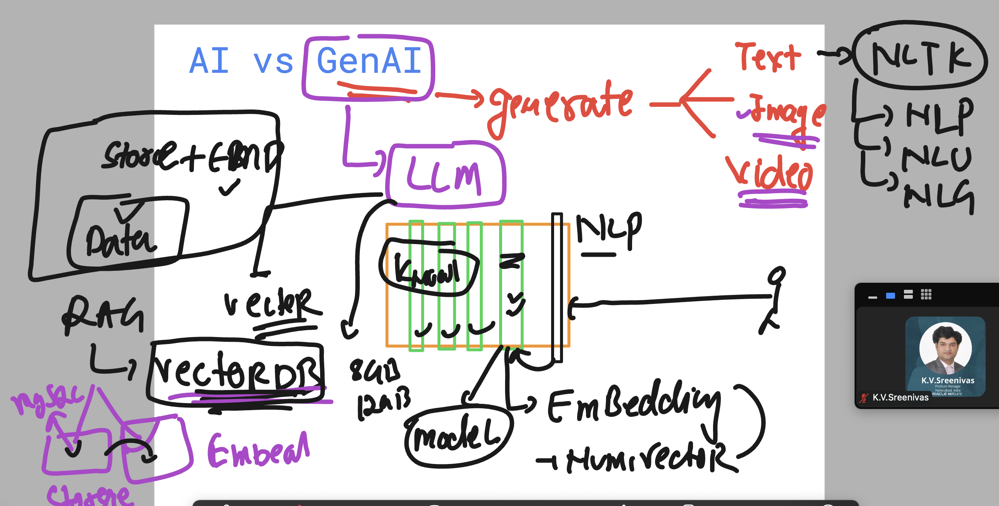
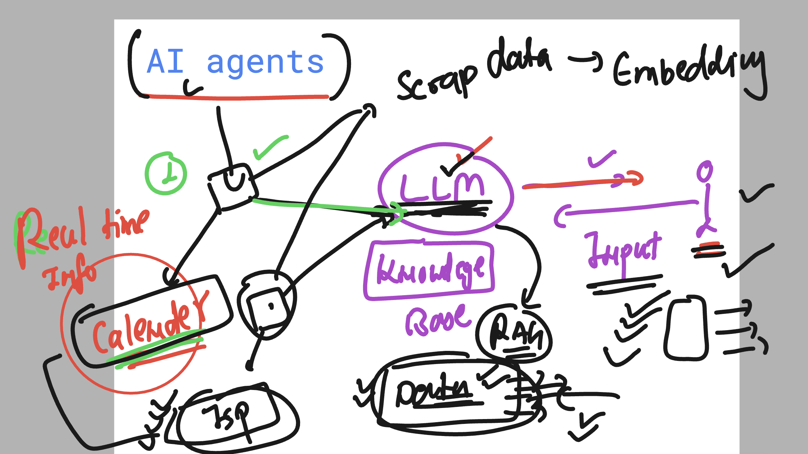
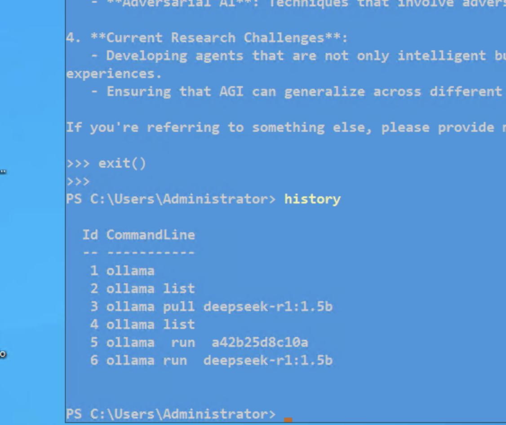
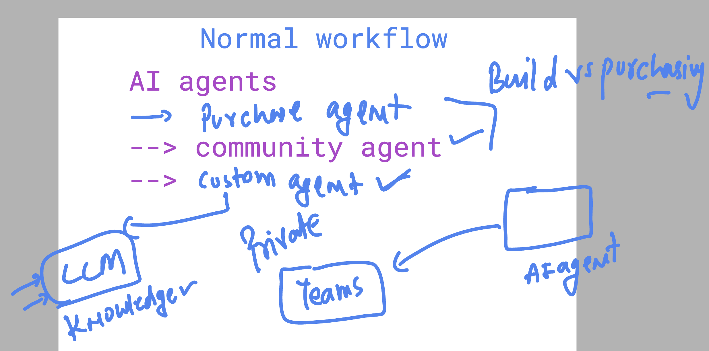

## welcome to final day 

### info GENAI 



###  AI agents & RAG info 



### we can run the model locally without internet after downloading 



## prompt template -- for more error handling 

```
Extract the following fields from the invoice EXACTLY in this JSON format. 
Return NOTHING ELSE except the valid JSON:

{
  "invoice_number": "<find alphanumeric ID like INV-1001>",
  "customer_number": "<locate numeric customer ID>",
  "gross_amount_with_vat": "<convert to float (e.g., €1,234.56 → 1234.56)>",
  "currency": "<extract ISO code like EUR/USD>"
}


Rules:
1. If a field is missing, use "null"
2. Always include VAT in gross_amount_with_vat
3. Remove thousand separators (1,234 → 1234)
4. Verify amounts against invoice totals section


Invoice Text:
{invoice}"

```

## Introducing AI agents sources 




